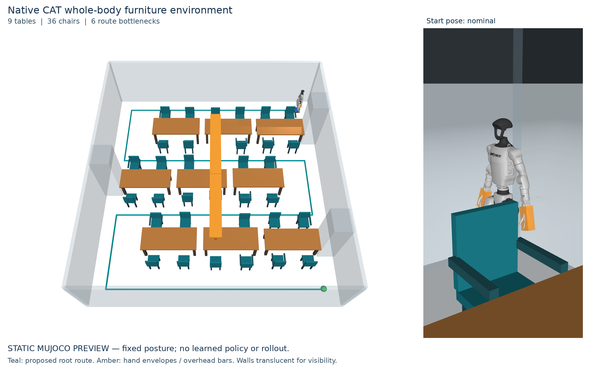

# CAT whole-body traversal and hand protection

This branch fine-tunes the original Click-and-Traverse (CAT) policy for **29-joint control** while adding dense clutter to its existing ground, lateral and overhead obstacle families. Generic clutter is a training domain; tables and chairs are the intended final demonstration. GRAIL-CAT is not a dependency.

The implementation is a research training and evaluation system. The included image is a static render of the actual MuJoCo collision scene. A policy that successfully traverses these rooms has **not yet been trained or demonstrated**.



## Setup

Development checkout: `~/robotics/Click-and-Traverse-WholeBody`, on the Mac and on `konstantin.smirnov@dep-0`. The GPU runtime uses Python 3.12.9, JAX 0.4.38, Brax 0.12.3, MuJoCo/MJX 3.3.1 and Playground 0.0.4. The pinned stack was checked on dep-0's RTX 5090 (32 GB). The Mac environment is for CPU checks and scene preparation.

```bash
git clone https://github.com/Skvayzer/Click-and-Traverse.git Click-and-Traverse-WholeBody
cd Click-and-Traverse-WholeBody
git checkout feature/whole-body-furniture-traversal
uv python install 3.12.9
uv venv --python 3.12.9 .venv
# Linux NVIDIA runtime:
uv pip install --python .venv/bin/python -r requirements/furniture-cuda12.txt
# Mac/CPU alternative: requirements/furniture-cpu.txt
export XLA_PYTHON_CLIENT_PREALLOCATE=false
export MUJOCO_GL=egl
```

`scikit-fmm` may compile a small native extension and needs a C/C++ build toolchain. This runtime uses the explicit requirements above; the upstream `uv.lock` remains for upstream workflows. It does not install the original project's unrelated deployment/ROS, TensorFlow or PyTorch stacks. Native checkpoints are downloaded from the pinned public CAT release automatically, so GitHub credentials are needed only to push code. W&B is disabled by default; choose `--wandb-mode online` to use the account already logged in on dep-0. No credentials are copied into the repository.

## Controller and hand protection

- Actions cover 12 leg joints, 3 waist joints and 14 arm/wrist joints. Twelve- and 23-action variants are available for comparisons.
- The published CAT actor, critic and normalizer are loaded from native training weights. Named input/output mappings retain the existing leg policy; new upper-body means start at zero with small exploration. Each fine-tuning stage uses a fresh optimizer and explicitly restores the critic. Warm-start parity is checked, rather than assuming a larger network preserved the original outputs.
- The original leg target-increment semantics are retained. Upper-body actions are bounded offsets from the nominal pose with joint limits and a 2 rad/s target slew limit.
- Conservative physical boxes cover the palm/finger region; additional arm, shoulder, torso, head and pelvis collision primitives are active. Finger articulation and hardware-specific injury thresholds are not modeled.
- Twenty-two hand/arm probes add current clearance, 0.2/0.4 s constant-velocity clearance estimates, obstacle normal, map age, unknown-space flag and position uncertainty. The full actor/critic sizes are 406/494. Prediction is a geometric approximation, not forward dynamics or a safety certificate.
- Reward combines route progress, CAT foot slip/clearance/balance terms, control costs, body clearance, and a hand clearance penalty that grows when the hand approaches a nearby surface. Collision or falling terminates the episode. These coefficients are initial research settings, not tuned results.
- Collision detection runs at each 2 ms physics substep and again at the final integrated pose. Any robot–obstacle contact, selected nonadjacent self-contact, or non-foot floor contact invalidates strict success; normal foot–floor support is allowed. Collision at the goal is a failure. There is no initial collision grace period.
- Controlled perception experiments can delay map packets, reduce their update rate, add translation noise and mark samples unknown. Clearance margins include voxel error, position noise and packet age. This is simulated map corruption; a real RGB-D/LiDAR reconstruction pipeline is future work.

Fixed raised/tucked/contextual arm presets are available as comparisons. Native forward kinematics verified that the raised preset lifts the lowest hand-envelope point by about 36 cm and that tucking reduces total hand-envelope width by about 17 cm at the nominal pose. These are static measurements, not evidence of walking stability or learned anticipation.

## How environments are built

`scene.json` is the canonical geometry and start/goal specification. The physical MuJoCo scene and potential-field arrays are generated from that same geometry, with hashes checked on loading. A changed goal, geometry, voxel grid or field file invalidates the cached bundle.

**Furniture:** tables have separate tops and four legs. Chairs have separate seats, backs, legs and optional armrests. Spaces beneath furniture remain open; a whole chair or table is not replaced by one convex collision hull. The dense default has nine tables and 36 chairs in three staggered rows, alternating blocked row ends, a winding route and six opposed-chair bottlenecks. Typical room size is about 9 × 9.4 m, with randomized dimensions and spacing. Six families emphasize table edges, chairs/armrests, slalom, asymmetry, overhead constraints and turns. The pilot room is intentionally simpler and is not the main benchmark.

**Generic clutter:** crates, low blocks, partitions and shelves replace the furniture objects with genuinely different collision geometry. They preserve the winding layout and dense clearances. Semantic object labels are not inputs to the controller.

**Original CAT families:** adapters call the upstream typical and random occupancy generators. Occupied voxels are merged losslessly into cuboids and translated into the new scene coordinate system. The original progressive 3D fast-marching guidance is used for these adapted scenes, retaining vertical guidance for stepping and crouching. This is an adaptation of the original generated environments with explicit physical obstacles and stricter collision scoring; it is not a claim of bit-identical published meshes or evaluation scores. Generator sources, parameters and geometry hashes are recorded.

Furniture/generic scenes use a goal-bound route-lookahead guidance field with boundary projection. It is explicitly distinguished in provenance from CAT's original fast-marching field. Their default grid resolution is 10 cm; original-family adapters use 4 cm. Thin furniture parts remain exact collision geometry even where a coarse voxel grid cannot resolve their interior; conservative grid margins are therefore included.

The generator checks a 23 cm radius root cylinder along furniture routes. This admits a narrow root path, but does **not** certify full-body or dynamically feasible traversal. Each environment additionally verifies the complete nominal reset pose with MuJoCo collision detection. Training and full episodes must establish whether the robot can execute the route.

```bash
.venv/bin/python -m cat_ppo.furniture.scenes generate \
  --output generated_scenes/furniture_dense --difficulty dense --family mixed --seed 0
.venv/bin/python -m cat_ppo.furniture.clutter \
  --output generated_scenes/generic_dense --difficulty dense --seed 0
# See adapter CLI for all original typical/random options:
.venv/bin/python -m cat_ppo.furniture.legacy_scenes generate --help
MUJOCO_GL=egl .venv/bin/python render_furniture.py \
  --scene-dir generated_scenes/furniture_dense --output outputs/dense.png
```

## Training scheme

The intended sequence is: expand the pretrained CAT policy on familiar easy scenes; learn isolated hand/arm encounters; progress to dense generic/furniture rooms; then add controlled map corruption. Original obstacle families continue throughout training, rather than being replaced by furniture.

The executable curriculum alternates one original CAT stage with one new-clutter stage. Across equal stage budgets, the mixture is **50% original CAT, 25% generic clutter and 25% furniture**. A round contains six original scenes (forward, hurdle, narrow gap, crouch, random obstacles and combined obstacles) interleaved with six new scenes. Round 1 uses pilot encounters, round 2 uses dense rooms, and round 3 adds delayed/noisy/partially unknown maps to dense rooms. Scene seeds change each round.

Each stage compiles its own physical scene and fine-tunes the same evolving model. This is sequential rehearsal with a fresh optimizer at each handoff, not simultaneous sampling of many room meshes in one batch. It makes scene changes physically consistent and keeps the first implementation inspectable; throughput and forgetting must be measured before increasing stage counts or budgets.

Prepare a concrete budget without starting training:

```bash
.venv/bin/python -m cat_ppo.furniture.curriculum prepare \
  --output outputs/plans/mixed_seed0.json --rounds 3 \
  --steps-per-stage 1048576 --num-envs 32 --seed 0 --wandb-mode online
```

This example plans 36 stages / 37,748,736 transitions. It is a starting budget, not a convergence estimate. Begin with a bounded pilot and tune the environment batch size to measured dense-scene GPU memory. Three independent training seeds are planned for the final study; they are not launched automatically.

Explicit execution and staged continuation:

```bash
.venv/bin/python -m cat_ppo.furniture.curriculum run \
  --plan outputs/plans/mixed_seed0.json --run-dir outputs/mixed_seed0 --max-stages 2
# Repeat without --max-stages to continue the remaining planned stages.
```

Standalone fine-tuning supports a designated validation scene:

```bash
.venv/bin/python train_furniture.py \
  --scene-dir generated_scenes/furniture_dense --run-dir outputs/furniture_seed0 \
  --steps 1048576 --num-envs 32 --checkpoint-epochs 2 \
  --env-config-json configs/furniture/P_oracle.json --wandb-mode online
# Optional: --warmstart PREVIOUS_RUN/checkpoints/best
# Optional validation: --num-evals 3 --validation-scene-dir VALIDATION_BUNDLE
```

The CLI refuses to round a requested step budget upward. Validation scenes must be explicitly labeled `validation` and differ from training geometry. Test scenes cannot select checkpoints. No evaluation runs by default.

**Checkpoint retention:** one selected native checkpoint per standalone run, replaced atomically with its metadata, plus its ONNX export. Within a curriculum, the predecessor's model is retired only after a successful verified next-stage handoff; metadata and metric history remain. No periodic checkpoint archive is kept. Interrupted handoffs preserve the recoverable model.

Without validation, selection is labeled **training proxy** (rollout reward); it is not benchmark-best or evidence of retained original skills. The curriculum ends with the final stage's selected model, not a model selected across all original and clutter domains. Use explicit held-out validation before choosing a final research/demo policy. ONNX export always reloads the selected native model and checks batchwise parity against native inference using highest float32 matmul precision.

## Comparisons and evaluation

Recipes in `configs/furniture/` cover retrained legs-only B1, 29-joint B2 without added hand observations/shaping, B3 with hand observations/urgency, full prediction/margin P, the 23-joint wrist ablation, fixed-arm heuristics, and the prediction × uncertainty-margin 2 × 2 comparison. B0 evaluates the unchanged released policy via named observation/action mapping. Every comparison uses the same physical collision geometry and strict success rule; disabling a shaping term never disables collision checks.

The benchmark manifest describes 120 held-out dense rooms (20 per family), three start/goal cases per room and three training seeds. The evaluation CLI runs one selected training seed at a time. Manifest creation does not run episodes:

```bash
.venv/bin/python -m cat_ppo.furniture.manifest \
  --output outputs/manifests/dense_test.json --split test
.venv/bin/python evaluate_furniture.py \
  --manifest outputs/manifests/dense_test.json --checkpoint outputs/furniture_seed0 \
  --training-seed 0 --controller P --output outputs/eval_seed0
```

Evaluation uses unwrapped episodes, independent geometric goal checks, latched physical contact outcomes, precise first-contact timestamps and explicit numerical failures. Reports include strict success, furniture/hand contacts, falls, timeouts, completion time with failure time caps, route progress and bottlenecks cleared before contact. Paired comparisons match scene/case/training/episode seeds and bootstrap by scene. A subset run is labeled a subset. Synthetic layout/dimension holdouts are not real-object identity holdouts.

The proposal's contact-reduction, success and time targets are research targets, not achieved results. Original-skill retention, dense-room learning, realistic perception, robustness to perturbed resets and robot deployment remain to be measured. The provided robot has conservative hand envelopes, not a calibrated articulated finger model. Do not treat an exported policy as deployment-validated.

## Verification and implementation map

Run CPU regression checks with `JAX_PLATFORMS=cpu .venv/bin/python -m pytest -q tests`. Checks cover collision-at-goal failure, final-substep contacts, action contracts, warm-start mapping, public native/ONNX parity, selected checkpoint export, cache corruption, hand postures, delayed perception, scene generation, strict metrics and checkpoint handoff/retention. `docs/IMPLEMENTATION_VERIFICATION.md` records the actual implementation smoke checks separately from performance experiments.

Main entry points: `train_furniture.py`, `evaluate_furniture.py`, `render_furniture.py` and `cat_ppo/furniture/curriculum.py`. Physical task: `cat_ppo/envs/g1/env_furniture.py`. Scene generators, pretrained adaptation, export, checkpoint storage and benchmark logic live in `cat_ppo/furniture/`. Upstream CAT entry points remain available.
