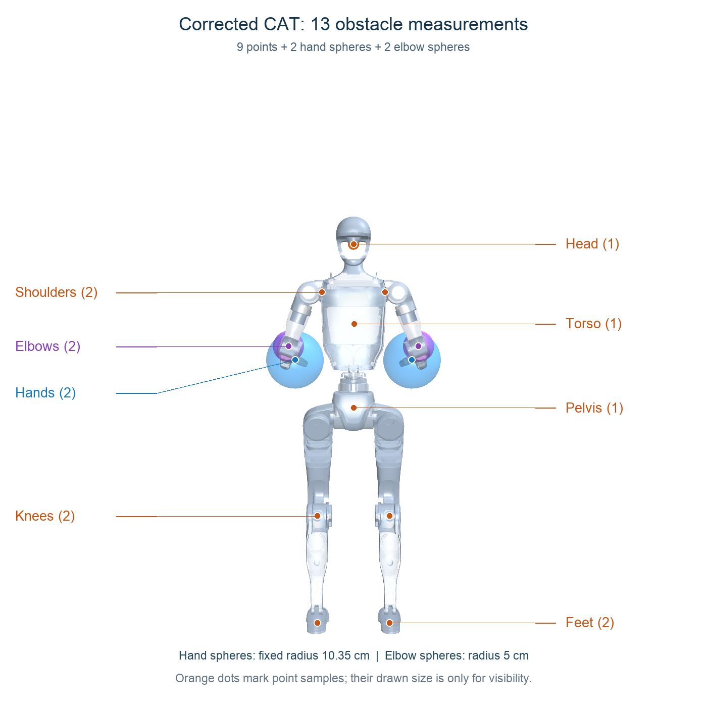
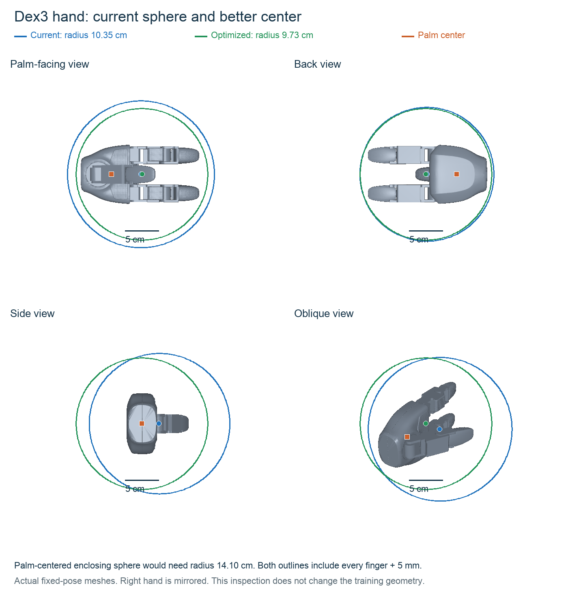

# Compact whole-body CAT setup

Implemented on 2026-09-16. The old 406-input training job was stopped, and a new continuous run with this compact contract was launched from the original released CAT checkpoint. See the [restart and GPU-capacity record](CAT_COMPACT_RESTART_20260916.md).

## Measurement geometry

There are 13 locations: nine original CAT point samples (head, torso, pelvis, two shoulders, two knees, two feet), two hand spheres that reuse CAT's existing palm slots, and two added elbow spheres.

Each hand uses one fixed sphere enclosing every palm and finger mesh vertex, including the thumb, with a 5 mm containment margin. Its center is fixed in the wrist frame and its radius is approximately 10.35 cm. Each elbow sphere has a 5 cm radius. The hand model retains its fixed Dex3 finger posture. Changing the finger configuration requires recomputing and validating the enclosing sphere.

### Hand-center inspection

The current center is the midpoint of the complete hand mesh bounds, not the palm center. The open hand measures approximately 17.55 × 9.31 × 8.78 cm. A numerical minimum-enclosing-sphere calculation moves the center 2.55 cm and reduces the radius from 10.3446 cm to 9.7349 cm, including the same 5 mm margin. Centering on the palm mesh instead would require a 14.0994 cm radius to cover the fingertips. Both current and optimized spheres were checked against the compiled MuJoCo mesh vertices, including the thumb. The optimized sphere is shown for comparison and has **not** replaced the training geometry.

Reproduce the inspection with `.venv/bin/python scripts/inspect_hand_spheres.py`; exact centers and containment margins are recorded in [geometry-audit.json](assets/hand-sphere-inspection/geometry-audit.json).

For a sphere, clearance is the obstacle signed distance sampled at its center minus its radius. There are no corner samples, forearm samples, future-distance samples, uncertainty, unknown-space, or age input channels in this compact contract. Existing physical hand–thigh collision boxes remain for simulator self-contact only; they do not add observations.

## Exact policy dimensions

| Component | Actor inputs |
| --- | ---: |
| Released CAT observation | 162 |
| Six wrist joint positions and velocities | 12 |
| Previous actions and targets for 17 added controlled joints | 34 |
| Two elbow locations × seven CAT field values | 14 |
| **Total** | **222** |

Each of the 13 locations provides three guidance-field values, three boundary-field values, and one clearance. The hands reuse the original two hand field slots. The original CAT body joint observations already include the waist, shoulders, and elbows; these are not added again.

The critic has 310 inputs, and the actor controls 29 body joints. The retired native whole-body contract had 406 actor and 494 critic inputs. Its legacy contract remains available for historical evaluation.

## Protection and learning

The original CAT hand collision reward and termination receive sphere-surface clearance. Additional hand and elbow shaping penalizes insufficient current clearance. The hand shaping margin is 12 cm outside the enclosing sphere surface; the elbow margin is 8 cm outside its sphere. This hand margin is conservative and is not numerically equivalent to the old point-based margin. Elbow collision termination uses the original 50-step grace convention. CAT control timing and the original reward terms remain present.

The spheres encode proximity, not a prescribed gesture. A policy can learn to raise or reposition its arms when that improves clearance and task return; this implementation does not guarantee a human-like arm posture. A sphere is intentionally conservative and cannot represent the extra clearance obtainable merely by rotating a long hand inside the same sphere.

**Remaining coverage limitation:** the nine unchanged original body locations are point queries, not enclosing spheres. Foot, shin and other body surfaces can intersect obstacles while those points remain outside. The later room trunk guard also does not cover the entire articulated body. See the [collision coverage report](CAT_COLLISION_COVERAGE_LIMITATION_20260916.md); reporting this limitation adds no observations or collision checks.

For the corrected experiment, initialize from the released CAT checkpoint through named feature/action mapping. The 60 added input rows start at zero; existing hidden layers and the original 12 action outputs are preserved. The 17 new action means start at zero with initial standard deviation 0.05. Geometry changes intentionally change the values in existing hand field slots, so weight preservation does not mean identical trajectories.

The previous 406-input training state must not be resumed directly into this 222-input contract. The launcher uses a separate run directory and rejects incompatible contracts. Historical 406-input checkpoint evaluation must use its matching frozen source tree. The corrected run starts from the original release, with fresh optimizer state.

## Validation

49 tests passed across native whole-body environment, gripper geometry, compact checkpoint mapping, and generalist launch checks. These include original CAT compatibility, actual reset/step dimensions, hand clearance correction without repeated subtraction, elbow feature ordering, hand mesh containment across varied arm/wrist poses, and forward-pass parity for preserved pretrained outputs. These checks establish implementation consistency, not trained navigation or hand-protection performance.

Regenerate the picture with `.venv/bin/python scripts/visualize_compact_cat_points.py`.
