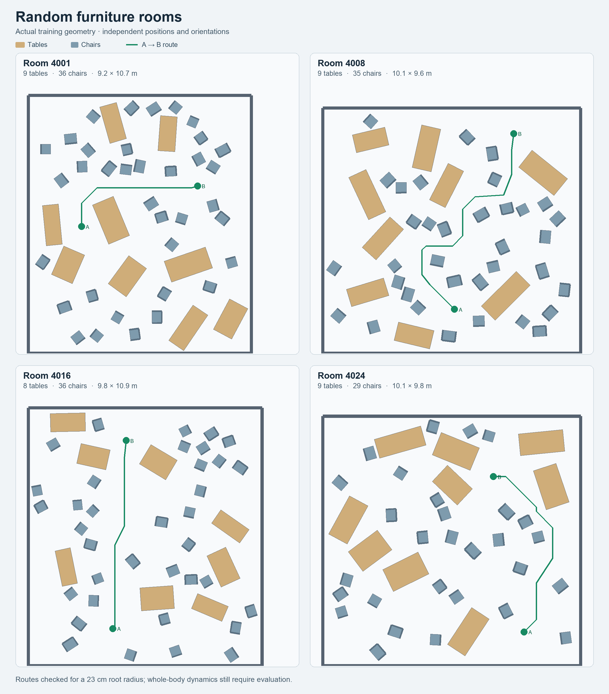

# Expanded CAT procedural and clutter training collection

This revision adds a materialized, reproducible scene bank to the compact whole-body CAT implementation. It expands the available public procedural collection; it does not reconstruct the unreleased paper training manifest or indoor scans. The existing training process and its frozen source were left unchanged.

## Coverage

The preparation requests 2,338 scene slots before deduplication and admission:

| Collection | Requested scenes |
| --- | ---: |
| Original checkpoint's scene slots | 37 |
| All published v1 typical layouts | 27 |
| New native CAT procedural candidates | 2,226 |
| Independently randomized furniture rooms | 24 |
| Independently randomized generic clutter rooms | 24 |

The completed bank retained **all 2,338 scenes**: zero admission rejections and zero exact field duplicates. Its fields occupy **14,215,263,552 bytes (13.239 GiB)** including NumPy file headers; raw runtime field arrays occupy 14,214,365,760 bytes. The validated manifest fingerprint is `e918eb5a51180ebb40a2030969c9f063a425b81f45796396952a786d2e9648e7`. The machine-readable [bank report](assets/cat-diversity-20260916/bank-report.json) records the source pins and final counts.

The bank was also generated directly on **ws008090** at `data/furniture/cat_diversity_v2_20260916/manifest.json`, with fingerprint `7fb43ee27324057f5a026eab05d837d380e208a45637a1f6e584208b1fa10967`. All scene IDs and recorded geometry fingerprints match the Mac bank, and all 64 original/published field sets are byte-identical. Newly computed numerical fields are not bit-identical across these two platforms, despite matching package versions. In a sample of 10,000 voxels per field in four generated scenes, the maximum SDF difference was 3.46 mm; maximum BF/GF component differences were 0.185/0.012. This is a sampled comparison, not a bound over all entries. Keep the chosen bank's immutable manifest with its run; do not interchange independently recomputed banks during resume. See the [comparison record](assets/cat-diversity-20260916/mac-ws008090-comparison.json).

The original anchor contains 36 byte-verified public scenes and the previously documented reconstruction of the missing `D8G2L3O2S13` slot. These are preserved. Typical layouts include forward walking, hurdles, repeated hurdles, crouching, side passages, and their released combinations. Their fields are downloaded unchanged and checked against pinned Hugging Face LFS hashes.

New procedural candidates call the original CAT generator directly: seven difficulties (0.4–1.0 in steps of 0.1), ground obstacle counts 0–3, lateral counts 0–9 on each side, overhead counts 0–3, and seeds 2001 and 2002. The empty obstacle combination is excluded. This covers all seven nonempty combinations of ground/lateral/overhead categories at each difficulty. Parameters are a finite, explicitly recorded sweep, not an exhaustive enumeration of continuous geometry or random seeds. CAT evaluation seeds 101–110 are excluded.

The pipeline remains occupancy → original signed-distance field → boundary-field gradient → original progressive three-dimensional fast-marching guidance. CAT scenes retain native coordinates, grid resolution, interpolation and the released runtime origin convention. No physical cuboid adapter is used in this bank.

Every candidate gets a recorded outcome. Nonfinite or disconnected procedural geometry is rejected; exact duplicate generated tasks are omitted from the sampling list and retained as aliases in `generation_coverage.json`. Original anchors and published layouts are preserved. A final manifest is published atomically only after provenance, field hashes, coverage and admission checks pass.

## Random clutter

Furniture seeds are 4001–4024; generic-clutter seeds are 5001–5024. Each dense furniture room contains 8–12 tables and 25–45 chairs. Complete objects are placed at continuous random XY coordinates and yaw angles, with nonoverlapping object footprints. There are no aligned rows or predefined empty corridors. Generic rooms independently place crates, low blocks, partitions and shelves.

After packing, an A* search finds an A-to-B route through the resulting geometry. The path uses an 8 cm grid with inflated obstacles, disallows diagonal corner cutting, and checks continuous segment clearance. This certifies a 23 cm torso/root radius over the documented root-height band. It does **not** certify full-body dynamic traversability; learning to move the arms through the remaining clutter is the task. Each scene retains multiple route cases; this bank trains on its first case.

The generated furniture collection includes easier and harder routes: their length is 1.014–2.153 times the straight-line distance, and root-inflated obstacles block 51.3–64.5% of room area. The certified minimum root margin varies from approximately 1.5 to 17.2 cm. Random placement does not force every route to be a difficult bottleneck.

Endpoint clearance is separately required to be at least 72 cm. This allows CAT's randomized joint pose and ±90° heading, plus the room's ±8 cm XY reset jitter, without changing the route's 23 cm root radius. The original weaker endpoint rule produced hand overlaps in sampled resets and was corrected before field generation. The corrected 48-room audit found zero overlaps in 12,288 randomized poses plus 48 nominal poses. Minimum sampled hand/body-query clearance was 21.4 cm for furniture and 16.5 cm for generic clutter. These are sampled static geometry checks, not a proof over all continuous poses or a navigation evaluation.



## One learner and scene sampling

All scenes participate in one persistent PPO learner and one W&B run. Global episode metrics remain unified. The v2 loader explicitly records each scene's reset, goal-crossing and timeout rules instead of inferring behavior from whether its source was an original asset.

| Group | Probability at an episode reset | Episode limit |
| --- | ---: | ---: |
| Original anchors + published layouts | 20% | 1,000 control steps |
| Newly generated CAT scenes | 40% | 1,000 control steps |
| Furniture | 25% | 4,000 control steps |
| Generic clutter | 15% | 4,000 control steps |

These group masses are an intentional extension for the mixed collection. Within each group, CAT's timeout-survival adaptive weights are retained, including the released EMA decay. They are **episode-start probabilities**, not equal fractions of training transitions: episode length and early terminations determine the actual experience proportions. A larger collection also makes per-scene EMA estimates sparser. Inverse-CDF sampling and indexed episode counts avoid a temporary matrix of every environment against every scene.

Original and newly generated CAT scenes preserve CAT's reset distribution and X-plane crossing convention. Rooms use their admitted start, route heading and goal-radius crossing. Training retains CAT's flat floor/feet-contact physics and field-based obstacle detection. Furniture is not added as rigid collision geometry to training physics.

The policy remains the compact **222 actor inputs, 310 critic inputs, 29 actions** setup: nine retained CAT point locations, two enclosing hand spheres reusing the original hand slots, and one new sphere at each elbow. See [the observation and hand-protection contract](CAT_COMPACT_SPHERE_SETUP_20260916.md). The hand-center inspection is a comparison only; the current 10.35 cm spheres have not been replaced by the 9.73 cm optimized alternative.

A new compact run initializes from the released CAT checkpoint using named feature/action mapping. The old 406-input full training state cannot resume directly into this architecture. The new default run directory is separate. No training restart was performed by this revision.

## Reproduction and validation

```bash
.venv/bin/python prepare_cat_diversity.py --plan
OMP_NUM_THREADS=1 OPENBLAS_NUM_THREADS=1 MKL_NUM_THREADS=1 \
  .venv/bin/python prepare_cat_diversity.py --download --workers 8
.venv/bin/python prepare_cat_diversity.py \
  --validate data/furniture/cat_diversity_v2_20260916/manifest.json
.venv/bin/python scripts/audit_room_resets.py
.venv/bin/python scripts/visualize_cat_diversity.py
.venv/bin/python scripts/validate_cat_diversity_runtime.py \
  --bank-manifest data/furniture/cat_diversity_v2_20260916/manifest.json \
  --output output_logs/full-bank-cpu-runtime.json
```

Scene caches are resumable and pinned to generation code and parameters. A changed generation specification requires a separate output directory. Training loads all retained maps; raw field bytes are recorded in the manifest. Host loading streams one field at a time. Accelerator memory and useful parallelism must be measured for this complete bank before launching a new run; the older run's memory usage does not establish the new bank's capacity.

The continuous PPO path passes the three field arrays as shared runtime arguments to compiled reset and training epochs. This avoids embedding the 13.24 GiB bank as JAX/XLA program constants. It leaves field values, numerical operations, environment state, rollout storage and checkpoint format unchanged. Small native-PPO tests verify closed-field versus dynamic-field parity and exact continuation after resume. The separate optional Brax evaluator still captures fields; it remains disabled (`num_evals=0`) in this continuous training setup.

Full-bank CPU validation on ws008090 passed: all 2,338 scene files were verified and loaded, followed by real JIT reset and a wrapped physics step for one representative of each family. Outputs were finite with shapes 5×222 and 5×310, and 29 actions. Serialized HLO sizes were 11.06 MB for reset and 23.11 MB for step, rather than embedding the 14.21 GB field arrays. Total validation time was 128.35 seconds. See the [runtime report](assets/cat-diversity-20260916/full-bank-cpu-runtime-ws008090.json).

## Gentle fine-tuning option

The launcher now defaults to `--finetuning gentle`: learning rate `3e-5` (released CAT `3e-4`), PPO clipping `0.1` (released `0.2`), and the released entropy coefficient `0.003`. These are explicit fine-tuning changes, not claims about CAT's original settings.

An additive loss uses a frozen copy of the initial actor and normalizer mapped from the **original released CAT checkpoint**. It penalizes `0.05 × KL(reference || current)`, summed over the original 12 leg action dimensions and averaged over CAT-scene transitions. Furniture/generic-room transitions and the 17 added action outputs receive no direct reference penalty. The shared network can still change. The reference consumes the same compact observations as the student, including the changed hand-sphere fields; it does not reconstruct CAT's original point measurements.

This combines smaller [PPO](https://arxiv.org/abs/1707.06347) updates with a policy-matching objective related to [policy distillation](https://arxiv.org/abs/1511.06295). The chosen coefficient and learning rate are conservative engineering settings, not empirically established retention guarantees. New arms retain exploration, while the full CAT scene collection continues to supply locomotion experience. Actual skill retention still requires evaluation.

The frozen actor/normalizer are saved in full runtime checkpoints and restored exactly. W&B receives `training/reference_kl`, `training/reference_kl_loss` and `training/reference_cat_fraction` alongside unified PPO/episode metrics. The 406-input checkpoints from previous incorrect setups are not used for initialization.

Tests cover source integrity, released-v1 compatibility, native procedural occupancy equality, cache corruption/rejection, duplicate aliases, route clearance, group probabilities, compact observations and actual JIT-compiled simulation/reset across all five families. Published typical layouts are now in training and therefore should not be described as held-out evaluation scenes. Use separate procedural seeds and separately generated validation/test rooms for generalization evaluation.
