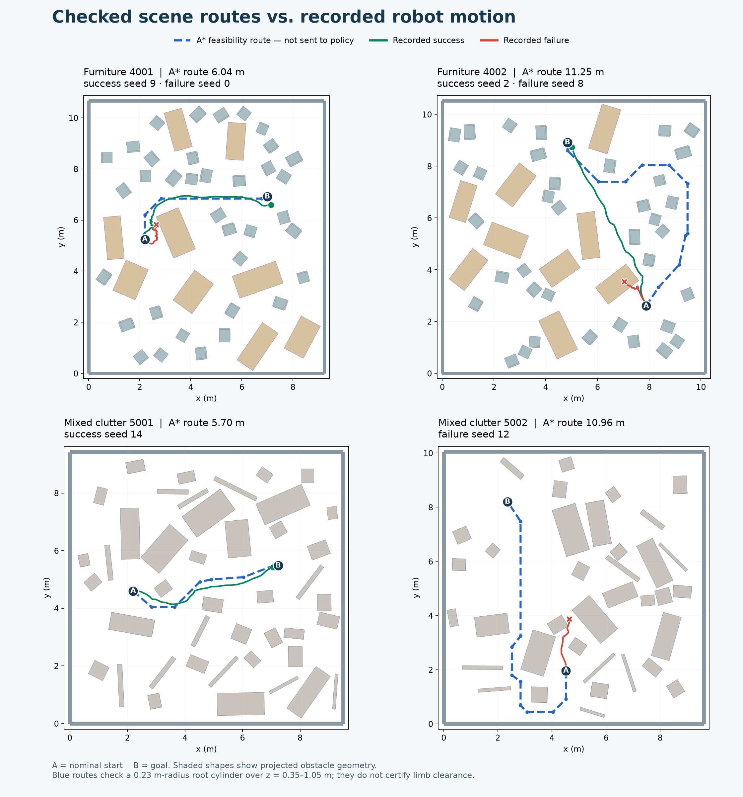

# Navigation routes in the recorded clutter scenes

The video map’s green line is the robot’s recorded root trajectory. It is not a planned path.

The scene generator computes an A* route to admit a randomly packed room. This checks a root cylinder of radius 0.23 m over heights 0.35–1.05 m. The checked route is stored in `scene.json`, but is not given to the policy. Each scene explicitly records `cat_field_generation.route_used_for_guidance: false`.

The actual CAT navigation input comes from a separately generated 3D fast-marching guidance field. It masks occupied voxels, computes distance to the goal, and progressively projects guidance tangentially near obstacle surfaces. The policy observes local guidance, boundary vectors and distances at body query locations. The velocity command begins with pelvis guidance and is adjusted using head, feet and hand fields. There is no waypoint-tracking term or cross-track constraint to the stored A* route.

| Scene | Checked route | Relation to recorded motion |
| --- | --- | --- |
| Furniture 4001 | 6.04 m: move upward around the nearby table, then right through the gap to the goal. | Successful seed 9 broadly follows the same corridor; failed seed 0 clips the nearby table region. |
| Furniture 4002 | 11.25 m: move toward the right edge, upward along that side, then left toward the goal. | Successful seed 2 takes a shorter 7.05 m central path; failed seed 8 moves into the table near the start. |
| Mixed clutter 5001 | 5.70 m: initially down-right, then through the central gap toward the right-hand goal. | Successful seed 14 broadly follows this corridor. |
| Mixed clutter 5002 | 10.96 m: first move down, around the bottom obstruction, left, and then upward along the left-side passage. | Failed seed 12 instead moves upward/right into clutter. |

Directions refer to the displayed map. Full waypoint coordinates and trajectory comparisons are in [route-comparison.json](assets/clutter-checkpoint-evaluation-20260916/route-comparison.json). Blue is the root feasibility route; green/red are the selected recorded success/failure trajectories.

All four saved routes pass the analytic root-cylinder check. Their conservative additional margins beyond the 0.23 m cylinder are 9.26 cm, 7.06 cm, 8.27 cm and 7.20 cm. These checks do not certify the arms, hands, whole articulated body or dynamic tracking. The actual guidance field is generated from uninflated 3D occupancy, so its point-based free-space topology can differ from the root-cylinder route. It can admit vertical passages or narrow gaps that a full robot cannot traverse in the same way.

This reveals a gap between room admission and actual policy guidance. It does not establish that every collision is caused by the guidance field; policy tracking and sparse body collision checks also contribute and must be distinguished. No training or generated scene was modified by this audit.

Source locations: `cat_ppo/furniture/random_rooms.py`, `cat_ppo/furniture/scenes.py::_route_clearance`, `cat_ppo/furniture/generalist_fields.py::make_clutter_fields`, `procedural_obstacle_generation/pf_modular.py::make_guidance_field_progressive`, `cat_ppo/envs/g1/env_cat.py::compute_cmd_from_rtf`.
