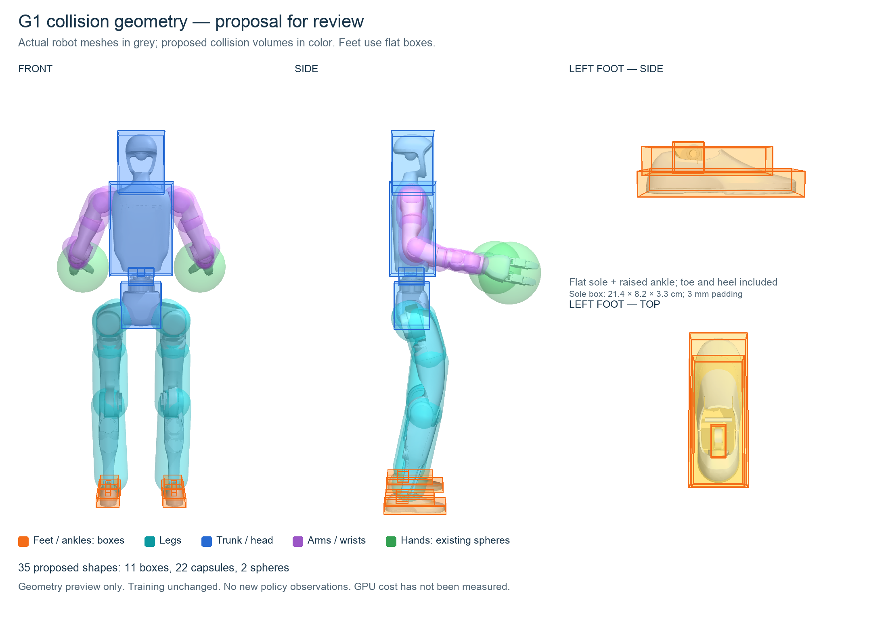

# Proposed body collision geometry — visual review

**Approved and implemented:** see [full-body collision training](CAT_BODY_COLLISION_TRAINING_20260916.md) for the subsequent runtime checks, learning signal, capacity and restart. The remainder preserves the original review artifact; its JSON describes the geometry proposal rather than runtime status.

This is a **geometry proposal for review**, not an active training change. It
approximates the actual fixed-Dex3 G1 meshes with boxes, capsules and spheres.
The existing floor contacts, obstacle checks, rewards and policy observations
are unchanged. Training remains stopped.



Grey surfaces are the actual robot meshes. Colored volumes are the proposed
collision shapes. The front and side views use the same pose; the foot panels
show the same left foot from the side and above. Arms are spread for visibility.

Feet use flat sole boxes plus separate boxes for their raised upper sections.
The ankle-pitch joints receive their own moving shapes. This avoids using a
large sphere for a flat foot or treating the articulated ankle as rigidly welded
to the sole. Capsules and small shapes follow the remaining body links; the
two existing enclosing Dex3 hand spheres are retained.

The fit uses **35 shapes: 11 boxes, 22 capsules and two hand spheres**. Each sole
box is approximately **21.42 × 8.16 × 3.34 cm**; the separate upper-foot box is
approximately **16.95 × 6.74 × 3.76 cm**. These include a 3 mm margin on each side.
The existing hand spheres retain their 5 mm mesh-containment margin. The original
18 × 6 × 1.6 cm floor-contact boxes are unchanged and are not the new proposal's
foot geometry.

Shapes are fitted in their owning body frames using the compiled robot mesh
transforms. Duplicate visual meshes are counted once. The foot split accounts
for triangles crossing its cut plane. Each assigned triangle is enclosed by
its convex primitive, with coverage checked again using forward kinematics.
The exact dimensions, assignments and validation results are recorded in
[proposal.json](assets/collision-proxy-proposal-20260916/proposal.json).

These are simulator-internal candidate collision volumes, not additional
observation features. Actor and critic inputs remain 222 and 310 respectively.
The proposal does not implement obstacle intersection tests or certify
collision-free motion. GPU memory and throughput have not been measured;
retaining at least 16,384 environments is a requirement for a later training
implementation, not an established result of this visualization.

Generate the picture and geometry audit with:

```bash
.venv/bin/python scripts/visualize_collision_proxy_proposal.py
```

The default also copies the PNG to `~/Downloads/CAT-collision-shapes-proposal.png`.
See the [collision coverage limitation](CAT_COLLISION_COVERAGE_LIMITATION_20260916.md)
for the failure mode motivating this proposal.
