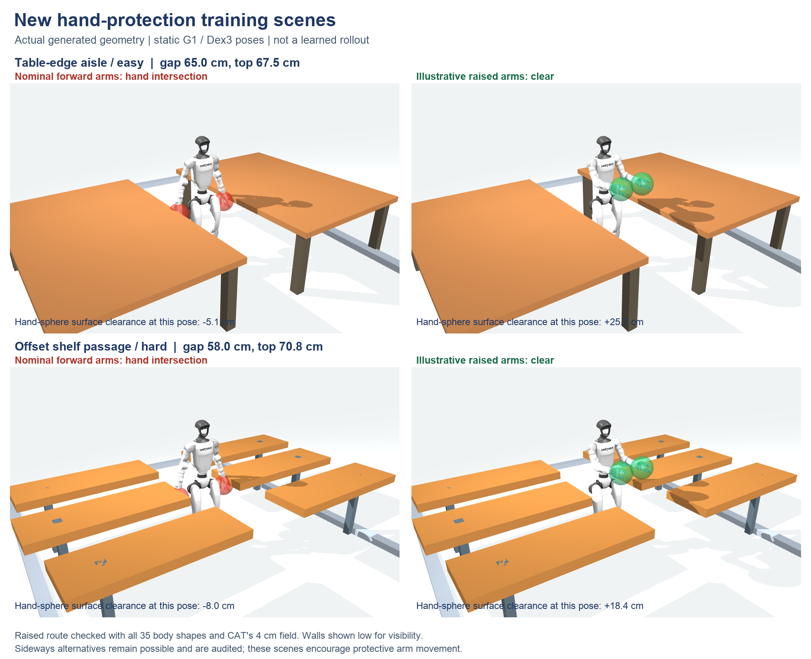

# Hand-protection fine-tuning, 17 September 2026

The `hand_protection` profile fine-tunes the protected, retention-selected best
checkpoint at **104,857,600 transitions**. It loads actor and critic weights with
a fresh Adam optimizer because the reward, action distribution and scene bank
change. It does not resume the later, weaker learner state. The permanent backup
is `archives/cat_best_before_hand_protection_20260917` on ws008090; its compressed
copy is in `~/Downloads/CAT-Checkpoint-Backups` on the Mac.

## Environments and what their checks establish



There are 24 new layouts: 12 table-edge aisles and 12 staggered shelf passages,
with four seeded variants at each of three difficulty levels. Passage widths
decrease from 64–67 cm to 56.5–59.5 cm; furniture surfaces are approximately
65–73.5 cm high. Position, angle, height and gap vary by seed. These are targeted
skill-training layouts; the old randomly oriented clutter rooms remain present.

Nominal forward walking intersects the hand spheres on 64–74% of sampled route
positions. Raised arms clear every approved body primitive and the **actual
conservative 4 cm CAT hand distance field**. Minimum hand field clearance is
10–21 cm at the raised preset, and 6–18 cm at 90% of that preset. Certification
also checks interpolation into and out of that posture at the approach/exit.
Easy layouts permit a tucked posture; the metadata explicitly marks cases where
tucking does not clear the training field. Presets certify feasibility only:
they are not demonstration actions, extra observations or a scripted controller.

**These scenes encourage arm protection; they do not force a unique motion.**
The constant-yaw audit finds a sideways alternative in every current layout.
The picture and certificates disclose that result. A complete continuous SE(2)
search and dynamic learned-policy traversal have not been established by these
static checks. Raising/tucking skill must be demonstrated by later rollouts.

All 2,338 existing scene records, fields, order and reset-pool rows are preserved.
The appended bank contains **2,362 layouts**. Hardlinks reuse old fields; only
the new fields (about 325 MB on disk), geometry index and appended reset rows
are generated. Both bank builders validate hashes before publishing manifests.
The reset builder rechecks all old and new poses with the collision checker.

At each episode reset, sampling retains 20% released CAT and 40% generated CAT.
Furniture contributes 12.5% old rooms and 12.5% new table aisles; generic clutter
contributes 7.5% old rooms and 7.5% new shelves. These are reset probabilities,
not proportions of transitions. Only easy hand tasks are initially eligible.
After at least 64 completed episodes at the current level and 60% clean goals,
the next level unlocks. Unlocked levels remain available. Native adaptive
sampling remains unchanged for old scenes. Curriculum state survives autoresets
and exact learner resume; it adds no policy observations.

## Reward and action distribution

The policy still receives **222 observations**, the critic **310**, and produces
**29 body actions**. G1 retains the fixed Dex3 grippers and the same hand/elbow
field samples and 35 collision primitives. CAT's floor contact physics,
locomotion rewards, scene diversity, failure rules and navigation fixes remain.

For each existing hand-surface distance `d`, the new normalized pressure is

```text
p(d) = 0.8 clip((0.04-d)/0.04, 0, 1)^2
     + 0.2 clip((0.20-d)/0.20, 0, 1)^2
r_hand = -0.5 mean(p(d_left), p(d_right)) dt,    dt = 0.02 s.
```

This costs at most 0.01 reward per control step and supplies an earlier signal
within 20 cm. There is no unconditional height bonus. Arm nominal-posture
regularization switches off near obstacles, independently for each arm, and
returns gradually over 20–30 cm hand clearance and 8–18 cm elbow clearance,
using the smaller of the two clearance gates. Arm target-acceleration cost
is reduced tenfold and velocity cost twofold; waist motion regularization is
unchanged, with waist posture stabilization retained near obstacles.

The actor MLP is unchanged. For the 14 arm outputs only, pre-tanh sampling uses

```text
u_t ~ Normal(0.05 mu_theta(o_t) + 0.95 atanh(a_(t-1)), s^2 D R D)
a_t = tanh(u_t).
s = sqrt(1 - 0.95^2) = 0.3122499.
```

`D` contains nominal arm standard deviations bounded to 0.02–0.10;
the actual conditional innovation deviations are `s D` (0.006245–0.031225).
`R` is a positive-definite fixed correlation matrix with raise/tuck factors and
an independent residual (correlation strength 0.8). The previous actions are
already present in observation slots 79–92. PPO evaluates the exact correlated
likelihood using those stored observations. Deterministic evaluation uses the
same conditioned mean. Legs and waist keep their existing distributions; the
reference KL acts only on the 12 independent leg actions on CAT scenes.

Persistence 0.95 has a roughly 0.39 s mean-response time constant. Scaling the
innovations by `sqrt(1-rho^2)` preserves the original stationary pre-tanh marginal
variance when the MLP mean and scale are held constant, while allowing correlated,
persistent arm exploration. The first unscaled candidate was rejected before
any PPO updates: stochastic ordinary-clutter success fell from 70.3% to 46.9%.
Its variance was 10.26 times the old variance. The startup gate prevented that
configuration from being trained. V2 checkpoint metadata records the innovation
scale; older V2 checkpoints without it retain their original scale of one. ONNX export
explicitly rejects this distribution until equivalent conditioning is supported.

PPO retains learning rate 3e-5, clipping 0.1 and the existing leg-only reference
KL coefficient 0.05. The reference actor is the selected best at the new run's
initialization. Resource target: **16,384 MJX environments**, batch size 256,
524,288 transitions per update, continuous training until manually stopped.

## Validation and W&B

One W&B run contains all families. The unchanged 16 regression layouts keep
their identities, seed ordinals and 16 seeds each; six hand layouts are appended
(one per kind and level). Both deterministic and stochastic policies are tested
every 50 updates. Validation ends at the first clean goal, failure or horizon.
Curriculum progression uses completed training episodes, which can last longer.

The initial and subsequent policies must pass an absolute retention comparison
against the protected best: CAT success may drop at most 5 percentage points,
and ordinary-clutter success at most 12.5 points, in either action mode. The
existing per-CAT-scene checks additionally compare to the new run's baseline.
Candidates failing a retention gate cannot replace the best checkpoint.

Useful charts:

- `validation/hand_protection_goal_success_rate`, `validation/hand_easy_goal_success_rate`,
  `validation/hand_medium_goal_success_rate`, `validation/hand_hard_goal_success_rate`.
- `validation/hand_protection_hand_violation_rate` and
  `validation/hand_protection_body_collision_rate`.
- `validation/cat_goal_success_rate` and
  `validation/ordinary_clutter_goal_success_rate`; also their stochastic versions.
- `hand_curriculum/stage`, active-level clean-goal rate and episode counts.
- Arm actual/target offset, target velocity, hand height and clearance-pressure
  telemetry; `training/arm_conditional_std_at_ceiling_fraction`.

Higher success alone does not establish raising: inspect joint/hand telemetry
and actual rollouts. Absolute returns cannot be directly compared to the old
run because its reward and task mix differ. Storage remains one rolling selected
best plus one overwritten full resume state, in addition to the protected backup.

## Build and launch

Use an isolated checkout on ws008090 with its existing `.venv` and asset/data
links. Build the appended field bank, body collision bank, and appended reset
pool in that order. The latter uses `--base-reset-manifest` to preserve old draws.

```bash
JAX_PLATFORMS=cpu .venv/bin/python scripts/build_hand_protection_bank.py \
  --base-manifest data/furniture/cat_diversity_v3_navigation_20260916/manifest.json \
  --output data/furniture/cat_hand_protection_v1_20260917 --workers 2

.venv/bin/python train_cat_wholebody.py run --finetuning hand_protection \
  --num-envs 16384 --batch-size 256 \
  --bank-manifest data/furniture/cat_hand_protection_v1_20260917/manifest.json \
  --body-collision-bank data/furniture/body_collision_hand_v1_20260917/manifest.json \
  --body-collision-resets data/furniture/body_collision_hand_resets_v1_20260917/manifest.json \
  --warmstart-best archives/cat_best_before_hand_protection_20260917 \
  --run-dir outputs/cat_hand_protection_20260917 --wandb-mode online
```
