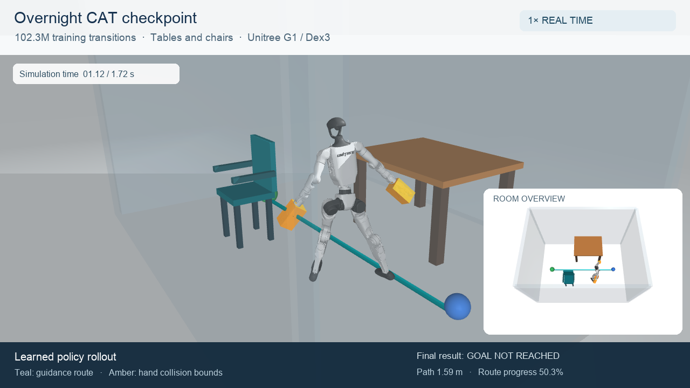

# Overnight CAT checkpoint recording — September 15, 2026

[Watch the video](assets/overnight-checkpoint-video/overnight-cat-checkpoint.mp4)

This is one complete deterministic episode from the retained overnight policy
at 102,301,696 cumulative training transitions. It travels 1.589 m in 1.72 s,
then terminates on furniture contact, at 50.31% route progress. The terminal
pose shows its right foot clipping a chair leg. There is no hand contact, fall,
self-collision or numerical failure in this episode; the goal is not reached.

The checkpoint is the selected step-8,388,608 model from
`continuous_cat_dex3_20260915_large/stages/r000001-p0-cat-forward`.
All 12 native payload files were copied from dep-0 and verified against their
saved hashes. Its actor and observation normalizer are restored through the
native Brax policy loader, with deterministic `tanh(mean)` actions.

The scene is the one-table, one-chair training scene
`pilot-mixed-train-000001-440e3f8cfde4`, previously used overnight in
`r000000-p1-furniture`. It is an early curriculum example, not the later dense
room. Episode seed is 0; the original observation noise and environment
settings are retained. The metadata's `environment_config` stores the supplied
training configuration; the constructor derives the effective 29 actions,
406 actor inputs and 494 privileged inputs from the furniture contract.

The episode ran on the Mac CPU through the original unwrapped MJX environment,
with no autoreset or injected posture. There are 86 control steps at 50 Hz and
87 saved physical poses, including the terminal pose. Rendering uses only these
poses and `mj_forward`; no extra physical motion is generated. The exact first
contact geometry at the 1.714 s physics substep was not stored; terminal native
contact inspection at 1.72 s identifies `right_foot` / `chair_00_leg_0`.
The clearance value -1 in raw telemetry is an unknown/out-of-map sentinel,
not one metre of penetration.

The 14.64 s video includes the full episode at normal speed, start/end holds,
and a clearly labeled quarter-speed replay. It is 1280×720 H.264 at 25 fps.
All 366 encoded frames decoded without errors; the sampled frames were
visually inspected. Current dep-0 training was left running throughout.

[Trajectory and outcome metadata](assets/overnight-checkpoint-video/metadata.json),
[frame verification](assets/overnight-checkpoint-video/video-validation.json),
and [contact sheet](assets/overnight-checkpoint-video/contact-sheet.png) accompany
it. The scripts are `record_checkpoint_rollout.py` and
`render_checkpoint_rollout.py`; use their `--help` for replay arguments.
