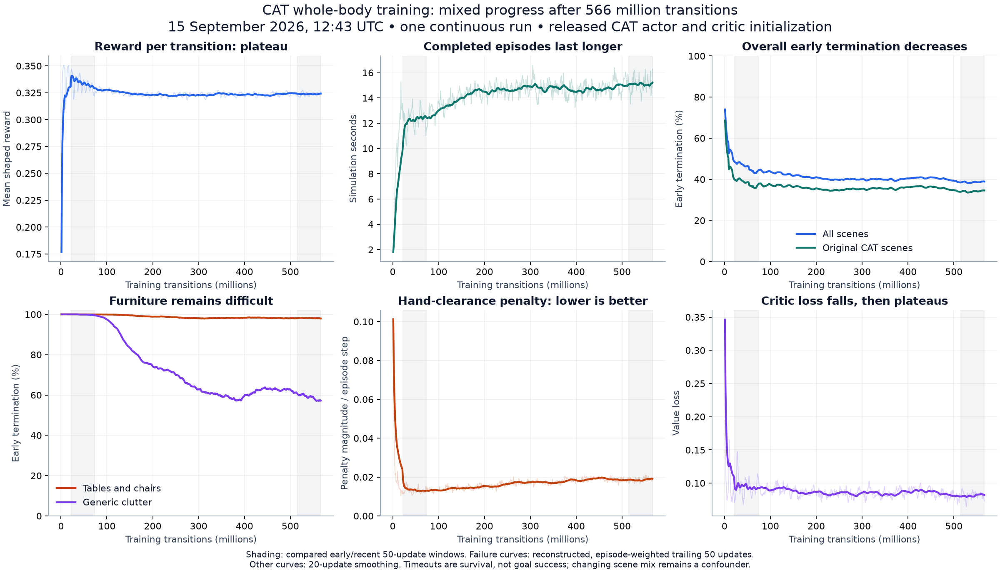

# Training progress at 12:43 UTC, 15 September 2026

**The run starts from pretrained CAT and is stable, but learning progress is mixed.** Survival improves, especially in generic clutter. Reward per transition has plateaued, furniture episodes still almost always end early, and the added hand-clearance objective has worsened after normalizing for episode length. These logs do not establish successful furniture traversal or superiority to pretrained CAT on a fixed evaluation.

[W&B run](https://wandb.ai/skvayzer/CAT-wholebody/runs/1d39c55c) · [Numeric results and method](assets/cat-progress-20260915-1243.json) · [PDF chart](assets/cat-progress-20260915-1243.pdf)

## State and initialization

The captured log has **540 complete PPO updates / 566,231,040 transitions**, after about 2 hours 6 minutes. PID 11525 is still the original process, with no restart and no logged nonfinite event. NVIDIA reports 30,425 MiB (29.71 GiB) used and 99% GPU utilization. Recent PPO throughput is approximately 87,500 transitions/s, excluding checkpoint writes. Training was left running unchanged.

The run record confirms native checkpoint `005033164800`, model revision `46ce4b57ba0639168d51741b661ff62f7ce6f045`, and restoration of **both actor and critic**. Expanded feature/action mappings passed zero-error actor/value parity for the preserved CAT outputs at initialization. The new waist/arm action outputs begin with zero means and 0.05 standard deviation; those added behaviors were not pretrained CAT skills. Adam was initialized once for fine-tuning. The live source remains `40b4dd2682dd4e5d75a6b853c24333da99379cf3`.

W&B independently reported the same single run as `running` at 12:44:17 UTC, with 570,425,344 transitions in its summary and finite losses.

## Comparison

Compare updates **21–70** (22.0–73.4 million transitions) with **491–540** (514.9–566.2 million). The early window excludes initialization transients but already contains fine-tuning; it is not an untrained baseline evaluation.

| Metric | Early window | Recent window | Interpretation |
|---|---:|---:|---|
| Reward per transition | 0.3322 | 0.3237 | Down 2.6%; broad plateau |
| Episode reward | 205.2 | 244.3 | Up 19%, partly because episodes last longer |
| Episode duration | 12.30 s | 15.06 s | Up 22% |
| Early termination, all scenes | 44.30% | 38.93% | Better survival |
| Early termination, original CAT scenes | 37.54% | 34.59% | Modest aggregate improvement |
| Early termination, furniture | 99.96% | 97.94% | Still almost every completed episode ends early |
| Early termination, generic clutter | 99.51% | 57.20% | Substantial survival improvement |
| Added hand penalty magnitude per episode step | 0.01315 | 0.01862 | About 42% worse; lower is better |
| Critic loss | 0.0949 | 0.0818 | Down 14%; does not establish better control |

The previous 50-update window had 38.48% overall early termination, compared with 38.93% most recently. Generic-clutter termination improved from 61.02% to 57.20% over those windows. The recent trend is therefore not uniform improvement: much of the overall survival gain happened earlier, while generic clutter continues improving.

The highest observed rollout reward is **0.35055 at 6,291,456 transitions**. The selected best model still comes from that update; the current learner continues beyond it and is stored in the overwritten full recovery file. Best-model selection does not roll the live learner back. The score is a training proxy from the rollout before the checkpoint's SGD update, not a held-out evaluation score.

## How the rate comparison was recovered

W&B's `rollout/*` charts average up to 1,000 update-level ratios. With only 540 updates, the displayed rate is mostly a cumulative-history average, not the latest failure fraction. For example, furniture's recent logged average is about 98.7%, while its actual last-50-update, episode-weighted rate is 97.94%.

There is one rollout-metric callback per update. For global metrics and each of the two clutter scenes, every update has episode completions in this snapshot. Their individual update values can therefore be recovered from successive cumulative means as `n * mean_n - (n - 1) * mean_previous`. Recovered completion and termination counts were checked to be positive/integer and to reconcile with cumulative completed episodes throughout the snapshot. Original-scene totals are the global totals minus both clutter scenes. An independent reconstruction of individual original-scene contribution counters confirmed these totals.

The recent window contains 69,360 completed episodes: 63,101 original-scene, 3,927 furniture, and 2,332 generic-clutter episodes. Of these, 21,825, 3,846, and 1,334 respectively ended early. These count-based rates avoid averaging percentages with unequal denominators. Episode reward, duration and reward-component summaries remain averages of the logger's last-1,000-completed-episode windows.

## What remains unproven

- Early termination merges falls, body/probe collision and invalid simulation states. The current logs do not separate these causes.
- Timeout means survival to 20 seconds in original scenes or 80 seconds in added rooms. It does **not** mean the goal was reached.
- The hand penalty measures proximity and predicted clearance, including closing motion. It is not a hand-impact count; its deterioration is a concerning objective trend, not proof of more physical finger impacts.
- Adaptive scene sampling and stochastic exploration change the training distribution. Episode reward grows partly through longer survival. There are no logged goal-success, distance-to-goal, minimum-hand-clearance or cause-specific collision metrics.
- A defensible claim that the policy outperforms transferred pretrained CAT requires evaluating both on the same scenes/seeds, with goal completion and hand protection measured directly. No such evaluation was run for this report, and training was neither interrupted nor modified.

The full read-only log snapshot is on the Mac under `outputs/analysis/cat-progress-20260915-1243`; its SHA256 is recorded in the numeric artifact.
