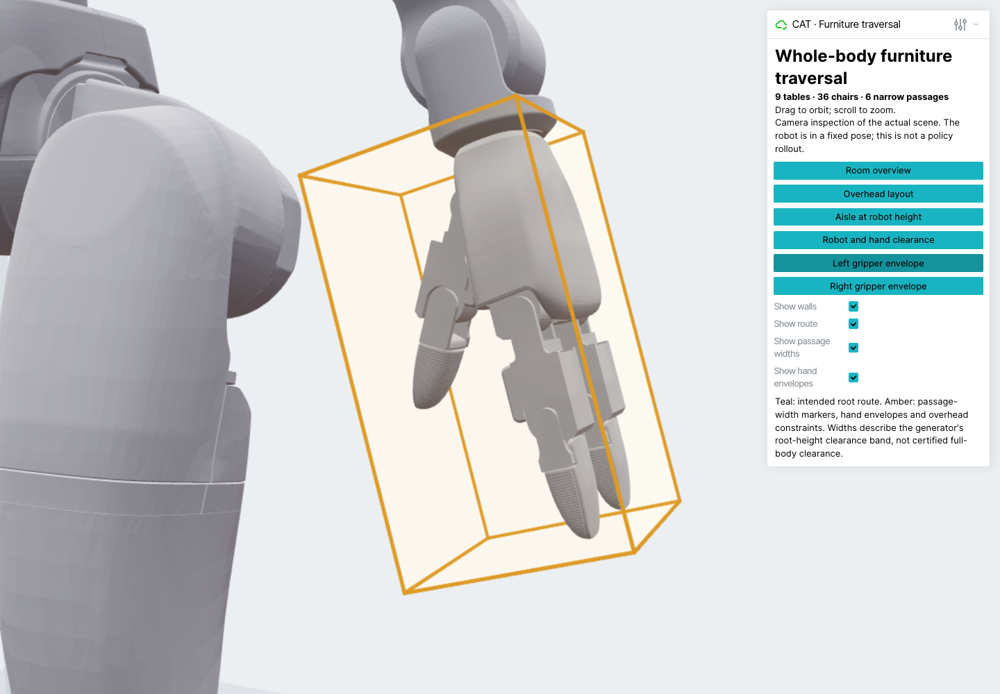
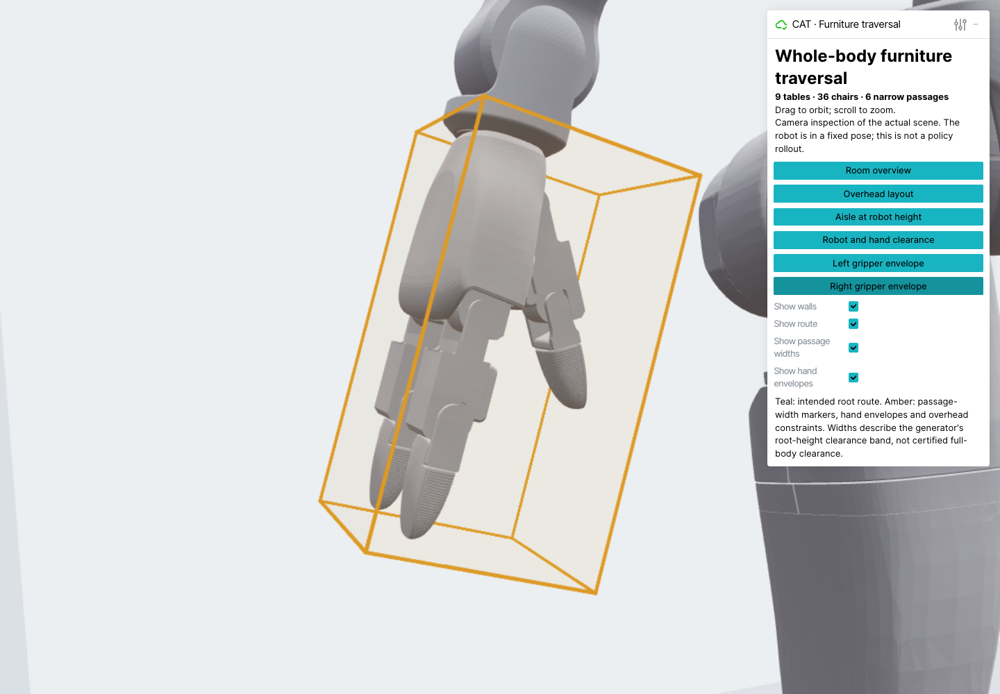
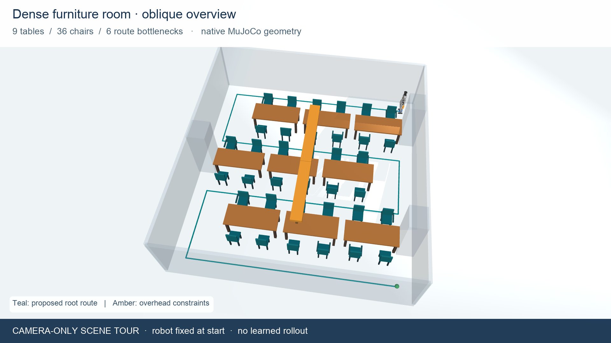
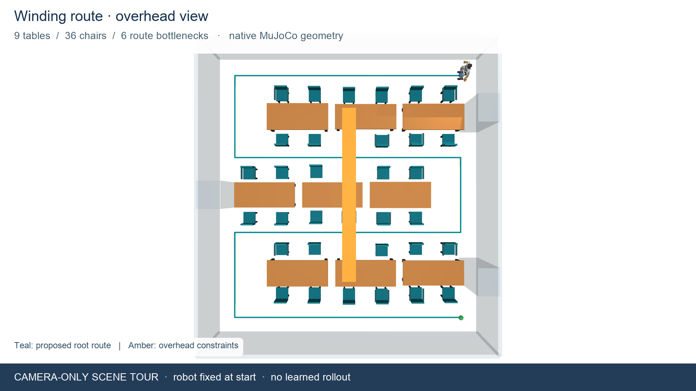
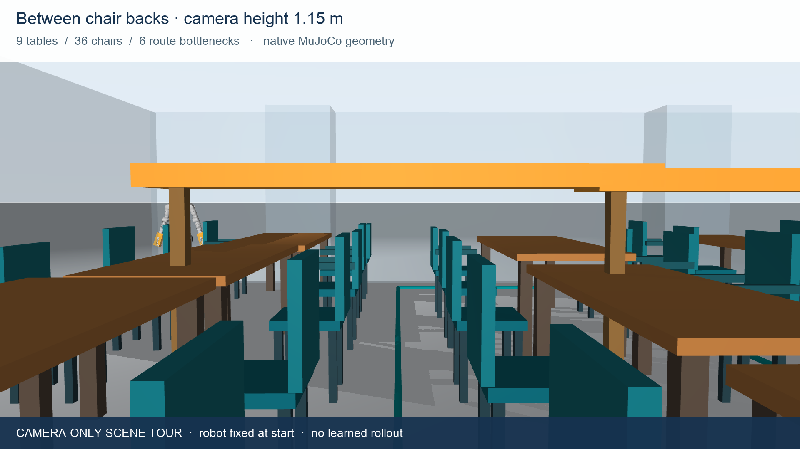

# Furniture environment visuals

The actual dense mixed scene contains **nine tables, 36 chairs and six narrow
passages** in a 9 × 9.55 m room. All visuals use its canonical physical geometry,
hash `9cfba94bcbc0b19e392455a9d3be2fe2a83be32d7363f4f3480b70ff4a41c2f9`.
The robot stays at its nominal start pose. Camera motion illustrates the room;
no learned policy or physics rollout is shown.

## Corrected Unitree hands — September 15

The live viewer now uses fixed Unitree Dex3-1 three-finger hands. Amber boxes
enclose every palm/finger mesh vertex, including the thumb, with 5 mm padding.
Their bounds are shared by the collision model and clearance probes. The
viewer has separate left/right gripper close-up buttons and transparent box
faces with visible edges.





[Native mesh containment report](assets/dex3-visuals/gripper-geometry-validation.json)

The room tours below were recorded on September 14 with the previous rigid
hand visuals. Their furniture layout is unchanged. Run the rendering commands
below at the current commit to obtain tours with the corrected hands.

## Room tours — September 14

[Watch/download the 27-second camera tour](assets/furniture-visuals/camera-tour.mp4)

[Watch the Viser viewer recording](assets/furniture-visuals/viser-tour.mp4)







Teal marks the intended root route. Amber indicates hand envelopes and the
overhead obstacles included in this mixed scene. Walls are translucent for
visibility; they remain part of the physical model. Tables/chairs use their
separate components, including the open spaces between legs.

## Interactive Viser viewer

Install the viewer in its own environment because Viser's supported trimesh
version differs from the pinned training runtime:

```bash
uv venv --python 3.12.9 .visual-venv
uv pip install --python .visual-venv/bin/python -r requirements/furniture-visuals.txt
.venv/bin/python -m cat_ppo.furniture.scenes generate \
  --output generated_scenes/viewer_dense --difficulty dense --family mixed --seed 0
.venv/bin/python view_furniture.py prepare \
  --scene-dir generated_scenes/viewer_dense --output outputs/viser_dense
.visual-venv/bin/python view_furniture.py serve --bundle outputs/viser_dense --port 8085
```

Open `http://127.0.0.1:8085` on the machine running the viewer. It provides room,
overhead, aisle and robot-close-up cameras, plus wall, route, passage-width and
hand-envelope toggles. Drag to orbit and scroll to zoom. The native MuJoCo robot
meshes are exported with their actual FK transforms; viewer assets are hashed
and verified before serving. The server listens on localhost only.

## Reproduce the native camera tour

Use the existing training environment for MuJoCo rendering and an available
FFmpeg binary. `--ffmpeg PATH` can point to the executable returned by
`.visual-venv/bin/python -c 'import imageio_ffmpeg; print(imageio_ffmpeg.get_ffmpeg_exe())'`.

```bash
.venv/bin/python render_furniture_tour.py \
  --scene-dir generated_scenes/viewer_dense --output-dir outputs/furniture_visuals
```

On Linux use `MUJOCO_GL=egl`; on macOS the script uses GLFW offscreen rendering.
The default video is H.264, 1280 × 720, 24 fps and 27 seconds. Three stills are
1920 × 1080. The output includes a geometry/source manifest. The supplied video
was decoded through all 648 frames without errors; the views and camera-tour
contact sheet were visually inspected.
